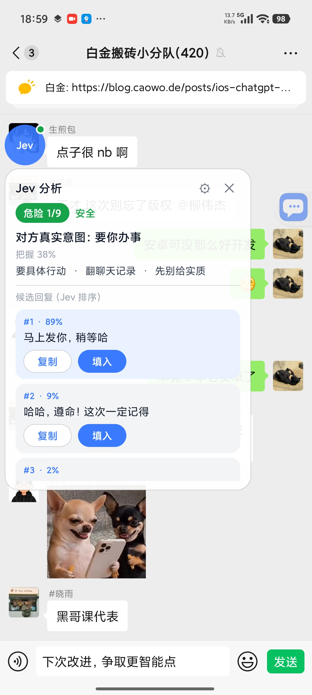
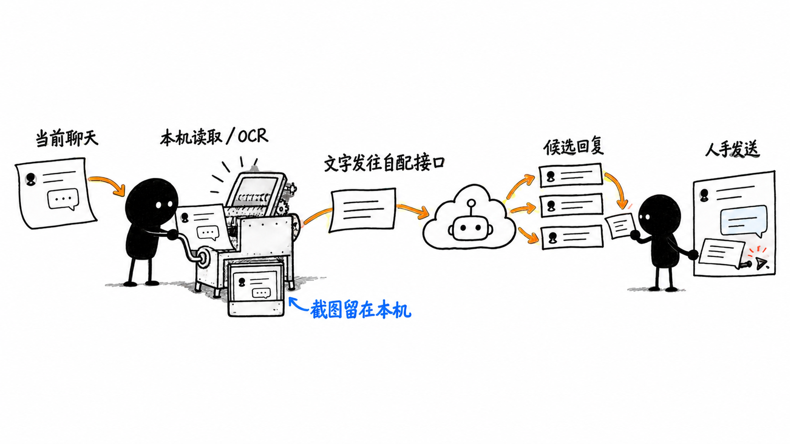

<div align="center">


# Jev 聊天助手

**“Trợ lý đồng hành hội thoại” cài trên điện thoại: hiểu người kia trong các ứng dụng chat được hỗ trợ, cho biết nên trả lời thế nào, điền vào ô nhập bằng một chạm; bạn tự quyết định có gửi hay không.**

[](https://github.com/jev-chat/jev-chat-jarvis/stargazers)
[](https://github.com/jev-chat/jev-chat-jarvis/forks)
[](CHANGELOG.md)
[](#bắt-đầu-nhanh)
[](LICENSE)

[Trang web](https://chatjevs.com) · [Chính sách quyền riêng tư](PRIVACY.md) · [Tải APK](apk/jev-assistant-v1.4-release.apk) · [Phiên bản trước](https://github.com/jev-chat/jev-chat-jarvis/releases) · [Nhật ký thay đổi](CHANGELOG.md) · [Bản macOS](https://github.com/jev-chat/jev-chat-jarvis-mac) · [Bản Windows](https://github.com/jev-chat/jev-chat-windows)

</div>

## ❤️Nhà tài trợ

> [Muốn xuất hiện ở đây?](#nhóm-trao-đổi--thu-thập-yêu-cầu)

<details open>
<summary>Nhấn để thu gọn</summary>

<table>
<tr>
<td width="240" align="center"><a href="https://open.bocha.cn"></a></td>
<td>Cảm ơn <b>博查</b> đã tài trợ cho dự án này! 博查 là một công cụ tìm kiếm dành cho AI, giúp ứng dụng AI của bạn kết nối với tri thức thế giới và tiếp cận kết quả tìm kiếm sạch, chính xác, chất lượng cao. Cung cấp Web Search API, Bocha Jev API cùng nhiều dịch vụ tìm kiếm trực tuyến và dịch vụ mô hình khác. <a href="https://open.bocha.cn">open.bocha.cn</a></td>
</tr>
<tr>
<td width="240" align="center"><a href="https://faka.rainlanguage.top"></a></td>
<td>Cảm ơn <b>小优店铺</b> đã tài trợ cho dự án này! 小优店铺 là một cửa hàng cung cấp sản phẩm số và dịch vụ tài khoản, cung cấp cho người dùng dự án một kênh mua sắm. <a href="https://faka.rainlanguage.top">Truy cập tại đây</a>.</td>
</tr>
<tr>
<td width="240" align="center"><a href="https://agent.ai-tools.cn"></a></td>
<td>Cảm ơn <b>速创猫 Vytal</b> đã tài trợ cho dự án này! 速创猫 Vytal là nền tảng quy trình làm việc video chuyên nghiệp bằng AI, cung cấp quy trình video có thể tái sử dụng hàng loạt, giúp giảm rào cản sản xuất nội dung và phục vụ nhà sáng tạo nội dung, cơ sở đào tạo cùng các nhóm vừa và nhỏ. <a href="https://agent.ai-tools.cn">Truy cập tại đây</a>.</td>
</tr>
</table>

</details>

## Ảnh chụp màn hình

<table align="center">
<tr>
<td align="center"><br/><sub>Cửa sổ nổi: mức độ nguy hiểm, ý định thật của đối phương và 3 câu trả lời đã được xếp hạng</sub></td>
<td align="center"><br/><sub>Trang cài đặt: có thể cấu hình riêng API phân tích, trả lời và thị giác</sub></td>
</tr>
</table>

## Lý do nên dùng

- **Nó phân tích trước, rồi mới soạn câu trả lời.** Hầu hết công cụ chỉ yêu cầu mô hình soạn thẳng một câu trả lời. Jev trước tiên dùng mô hình phân tích để xác định ý định thật của đối phương, mức độ nguy hiểm, có nên trả lời ngay hay không, rồi mới soạn câu trả lời dựa trên kết quả đó.
- **Không can thiệp vào ứng dụng chat của bạn.** Không hook, không sửa gói, không sử dụng API hay tài khoản của bất kỳ ứng dụng nào, không đọc cơ sở dữ liệu; chỉ dùng dịch vụ trợ năng của hệ thống để đọc cuộc trò chuyện đang hiển thị trên màn hình.
- **Quyền gửi luôn thuộc về bạn.** Ứng dụng chỉ điền câu trả lời vào ô nhập, không bao giờ tự gửi, không can thiệp vào việc chuyển tiền, lì xì hoặc thu tiền.
- **Một lõi, nhiều nền tảng.** QQ và X đã chạy thử trên thiết bị thật; 飞书 bổ sung nội dung chính bằng OCR. Thêm một ứng dụng chỉ cần viết một adapter vài chục dòng; phiên bản Android của 微信 đã bị gỡ khỏi cửa hàng ứng dụng hoàn toàn, không còn thu thập hay xử lý nội dung 微信.
- **Nó hiểu những người và việc liên quan đến bạn.** Cơ sở tri thức cục bộ và hồ sơ liên hệ tự động đưa các ghi chú phù hợp cùng lịch sử trò chuyện của người đó vào quá trình phân tích, giúp câu trả lời không mâu thuẫn với thiết lập của bạn.
- **Bạn tự cấu hình API.** Địa chỉ, khóa và mô hình cho ba luồng phân tích, trả lời và thị giác đều có thể điền riêng. Khi phân tích, nội dung trò chuyện và thông tin nền đang bật sẽ được gửi tới nhà cung cấp mô hình mà bạn cấu hình; tác giả không vận hành máy chủ trung gian.
- **Có thể kiểm soát dữ liệu lưu trên máy.** Khóa, cơ sở tri thức và lịch sử tùy chọn nằm trong không gian riêng của ứng dụng; ảnh chụp màn hình chỉ được OCR trên máy và không tải lên. Cách nhà cung cấp bên thứ ba xử lý nội dung nhận được tuân theo chính sách quyền riêng tư của họ.

## Hỗ trợ nền tảng

| Nền tảng | Trạng thái | Cách thu thập | Ghi chú |
|---|---|---|---|
| QQ Android | ✅ Hỗ trợ đầy đủ từ đầu đến cuối | Đọc node bằng dịch vụ trợ năng | Đã kiểm thử trên 9.3.50 (trò chuyện nhóm); 1v1 được suy luận theo cùng cấu trúc |
| X / Twitter tin nhắn riêng | ✅ Hỗ trợ đầy đủ từ đầu đến cuối | Phân tích content-desc của node Compose | Đã kiểm thử trên 12.25, giao diện tiếng Trung; chưa xác minh giao diện tiếng Anh |
| 飞书 / Lark | ✅ Dự phòng bằng OCR (đã xác minh trên thiết bị thật) | Đọc hình chữ nhật bong bóng bằng dịch vụ trợ năng + OCR tiếng Trung ngoại tuyến bằng ML Kit để nhận dạng nội dung chính | Nội dung chính tự vẽ không có trong cây trợ năng; từ 1.3, thực hiện OCR cho hình chữ nhật từng bong bóng; phân biệt tôi/đối phương theo trạng thái đã đọc |
| Ứng dụng khác chưa hỗ trợ (trừ 微信) | ✅ Thủ công | OCR toàn màn hình bằng “Nhận diện ảnh chụp một lần” trong menu cửa sổ nổi | Không tự động, không phân biệt tôi/đối phương (mọi nội dung đều được coi là lời của đối phương và được ghi rõ trong khung phân tích); phiên bản Android của 微信 đã bị gỡ khỏi cửa hàng ứng dụng hoàn toàn |
| Máy tính để bàn / web | ⏳ Đang lên kế hoạch | Ảnh chụp màn hình + OCR / thị giác | Cùng một lõi, chỉ thay đổi cách thu thập |

Dự án này chỉ đọc nội dung chat trên thiết bị của chính bạn, nơi bạn có quyền xem và phiên bản hiện tại hỗ trợ; phiên bản Android của 微信 đã bị gỡ khỏi cửa hàng ứng dụng hoàn toàn, không cung cấp tính năng thu thập hay phân tích 微信.

## Bắt đầu nhanh

**1. Cài đặt.** Kho lưu trữ có gói release đã ký: [`apk/jev-assistant-v1.4-release.apk`](apk/jev-assistant-v1.4-release.apk) (Android 11+, chỉ hỗ trợ ARM64 / `arm64-v8a`). Gói cài đặt của các phiên bản khác cũng có trong [Releases](https://github.com/jev-chat/jev-chat-jarvis/releases).

```bash
adb install -r apk/jev-assistant-v1.4-release.apk
```

**2. Nhập khóa.** Mở ứng dụng → Cài đặt → “API”, chia thành ba thẻ: API phân tích / API trả lời / API thị giác. Cách đơn giản nhất là chỉ điền [API Key của OpenRouter](https://openrouter.ai/) vào thẻ “API phân tích”; để trống hai thẻ còn lại để chúng tự động kế thừa khóa này và ứng dụng sẽ dùng được. Nếu muốn đổi mô hình trả lời (mặc định `deepseek/deepseek-chat-v3.1`; Gemini / OpenAI tại Trung Quốc sẽ bị giới hạn theo khu vực), hãy chọn một cấu hình có sẵn trong “API trả lời” (OpenRouter / DeepSeek chính thức / 通义兼容) hoặc tự nhập địa chỉ; mỗi thẻ có chức năng kiểm tra kết nối độc lập bằng một chạm.

**3. Bật quyền.** Làm theo hướng dẫn trên trang chủ để bật ba quyền:

- Trợ năng (đọc giao diện chat hiện được hỗ trợ; sau khi nâng cấp lên 1.3+, cần tắt rồi bật lại trợ năng để khả năng chụp màn hình có hiệu lực)
- Cửa sổ nổi / Hiển thị trên ứng dụng khác (hiển thị kết quả phân tích)
- Tự khởi động + không hạn chế tối ưu hóa pin (bắt buộc trên Xiaomi / HyperOS, nếu không tiến trình nền sẽ bị đóng băng và không thể đọc tin nhắn)

Người dùng đã cài gói debug phải gỡ cài đặt trước khi cài release (chữ ký khác nhau), và việc gỡ cài đặt sẽ xóa cả khóa lẫn thiết lập. Sau khi cài lại trên Xiaomi / HyperOS, quyền cửa sổ nổi sẽ bị đặt lại; sau khi cài, hãy bật lại theo hướng dẫn.

## Tính năng

### Phân tích và câu trả lời ứng viên

- Mô hình phân tích trả lời một lần với: ý định thật của đối phương, mức độ nguy hiểm (1–9), điều đối phương muốn, có nên trả lời ngay hay không, hành động tốt nhất. Khoảng 1 giây, kèm mức độ chắc chắn.
- Mô hình tạo sinh soạn 3 câu trả lời ứng viên bằng văn phong nói tự nhiên; mô hình phân tích xếp hạng theo mức “phù hợp nhất” và đưa ra tỷ lệ.
- Chạm một lần trong cửa sổ nổi để sao chép hoặc điền câu trả lời; thao tác điền dùng `ACTION_SET_TEXT`, nếu thất bại sẽ tự chuyển sang dán từ bảng nhớ tạm, **trong mọi trường hợp đều không gửi**.

### Cơ sở tri thức và liên hệ

Tại Cài đặt → Phân tích → “Cơ sở tri thức và liên hệ”.

- **Ghi chú**: tiêu đề / nội dung / thẻ / thường trực. Ghi chú thường trực luôn được đưa vào; các ghi chú khác chỉ được đưa vào khi thẻ hoặc tiêu đề xuất hiện trong tiêu đề cuộc trò chuyện hoặc trong 6 tin nhắn gần nhất, tối đa 5 ghi chú. Hỗ trợ nhập bằng cách dán văn bản nhiều dòng, phân đoạn theo dòng trống và lấy dòng đầu mỗi đoạn làm tiêu đề.
- **Liên hệ**: tên / bí danh (mỗi dòng một bí danh) / quan hệ / ghi chú. Có hiệu lực khi tiêu đề cuộc trò chuyện khớp với tên hoặc bất kỳ bí danh nào; tự động bỏ qua số người ở cuối tên nhóm, khoảng trắng đầu/cuối và khác biệt chữ hoa chữ thường. Có thể nhấn giữ vào bong bóng cửa sổ nổi để lưu nhanh cuộc trò chuyện hiện tại làm liên hệ bằng một chạm.
- **Lịch sử**: “Ghi lại lịch sử trò chuyện (chỉ lưu trên máy)” mặc định tắt; khi bật, mỗi lần phân tích sẽ kèm N tin nhắn gần nhất (mặc định 30) và tự động loại bỏ phần đã hiển thị trên màn hình.
- **Xóa**: cơ sở tri thức và lịch sử đều nằm trong thư mục riêng của ứng dụng; nút “Xóa cơ sở tri thức và lịch sử” trong cài đặt xóa toàn bộ chỉ bằng một lần nhấn, không ghi vào nhật ký, không đưa vào git. Xem [chính sách quyền riêng tư](PRIVACY.md) để biết các loại dữ liệu cụ thể, mục đích, bên nhận và cách lưu giữ.
- Phần đầu khung phân tích trong cửa sổ nổi hiển thị một dòng “Cơ sở tri thức N mục · Lịch sử M mục” để tiện xác nhận những gì đã được đưa vào.

### API và mô hình

- Địa chỉ, khóa và mô hình của ba luồng phân tích / trả lời / thị giác có thể điền riêng.
- API phân tích bổ sung cấu hình tích hợp “博查 Jev”, ở vị trí thứ hai (OpenRouter / 博查 Jev / TypeSafe trực tiếp / Vercel / OpenCode Zen / Tùy chỉnh); khi chọn, ứng dụng tự điền địa chỉ dịch vụ `https://jev.bocha.cn` và mô hình `bocha-jev-v1` (giao thức giống TypeSafe), hiển thị địa chỉ chính thức trên trang và hỗ trợ sao chép bằng một chạm; hiện miễn phí trong thời gian giới hạn. Bản cài mới mặc định dùng OpenRouter; người dùng cũ đã cấu hình API phân tích không bị ảnh hưởng, provider và khóa đều không thay đổi.
- API phân tích có thêm cấu hình tích hợp “Vercel”: địa chỉ `https://ai-gateway.vercel.sh/typesafe`, mô hình `typesafe-ai/jev`, sử dụng khóa từ [Vercel AI Gateway](https://vercel.com/ai-gateway/models/jev). Giao thức giống kết nối trực tiếp TypeSafe (`POST /v1/systemone`).
- API phân tích có thêm cấu hình tích hợp “OpenCode Zen”: địa chỉ `https://opencode.ai/zen`, mô hình `jev-1.13` (đầu ra miễn phí, đầu vào $0.042/M, mỗi lần phân tích khoảng 1000 token đầu vào), sử dụng khóa từ [OpenCode Zen](https://opencode.ai/zen). Giao thức giống kết nối trực tiếp TypeSafe (`POST /v1/systemone`); nếu muốn dùng hoàn toàn miễn phí, có thể đổi thủ công thành `jev-1.13-free` (miễn phí trong thời gian giới hạn, chức năng bị hạn chế).
- Có sẵn các cấu hình OpenRouter / 博查 Jev / TypeSafe trực tiếp / Vercel / OpenCode Zen / DeepSeek chính thức / 通义兼容; mỗi thẻ có thể kiểm tra kết nối bằng một chạm.
- Chỉ cần một khóa là có thể dùng: nếu API trả lời và thị giác để trống, chúng sẽ tự động kế thừa cấu hình của API phân tích.
- Khi nâng cấp từ phiên bản cũ, khóa cũ sẽ được chuyển sang cấu trúc ba thẻ mới đúng một lần.

### Thu thập và OCR

- Mỗi ứng dụng có một adapter; dịch vụ phân phối theo tên gói của ứng dụng đang ở tiền cảnh, adapter chỉ chịu trách nhiệm biến cửa sổ hiện tại thành “tiêu đề + danh sách tin nhắn”.
- Khi cây trợ năng không có nội dung chính, ứng dụng chat được hỗ trợ sẽ tự động chụp màn hình và dùng mô hình tiếng Trung ngoại tuyến của ML Kit để nhận diện; không tải ảnh lên và không cần dịch vụ Google.
- Việc chụp màn hình có giới hạn tần suất và cơ chế lùi thời gian chờ khi thất bại, không chụp liên tục mỗi giây; khi nhận diện sẽ tránh cửa sổ nổi của chính ứng dụng.
- Với ứng dụng chưa được hỗ trợ (trừ 微信), có thể kích hoạt thủ công “Nhận diện ảnh chụp một lần” từ menu cửa sổ nổi.

## Câu hỏi thường gặp

<details>
<summary><b>Ứng dụng có tự gửi tin nhắn thay tôi không?</b></summary>

Không. Ứng dụng chỉ điền câu trả lời đã chọn vào ô nhập; bạn luôn tự bấm nút gửi. Ứng dụng không bao giờ can thiệp vào việc chuyển tiền, lì xì hoặc thu tiền.

</details>

<details>
<summary><b>Có cần root hay Xposed không? Tài khoản có bị khóa không?</b></summary>

Không cần root và không phải cài bất kỳ module nào. Ứng dụng không sửa gói cài đặt của ứng dụng chat, không tiêm mã vào tiến trình, không gọi API hay hệ thống tài khoản của ứng dụng khác, mà chỉ đọc nội dung giao diện do dịch vụ trợ năng của hệ thống cung cấp, giống như một phần mềm đọc màn hình.

</details>

<details>
<summary><b>Lịch sử trò chuyện của tôi có được tải lên không?</b></summary>

Khi kích hoạt phân tích, nội dung chat hiện tại cùng ghi chú liên hệ mà bạn đã bật, nội dung cơ sở tri thức được truy xuất và lịch sử trò chuyện sẽ được gửi tới API mô hình mà bạn cấu hình trong cài đặt. Tác giả dự án không vận hành máy chủ trung gian và không nhận được nội dung này; ảnh chụp màn hình được OCR trên máy và không tải lên. Lịch sử mặc định tắt; khi bật, lịch sử chỉ được lưu trong thư mục riêng của ứng dụng trên máy. Nhà cung cấp mô hình bên thứ ba có thể xử lý nội dung yêu cầu theo chính sách của họ; vui lòng xem [chính sách quyền riêng tư](PRIVACY.md) và chính sách của nhà cung cấp đã chọn trước khi sử dụng.

</details>

<details>
<summary><b>Bong bóng nổi biến mất hoặc không đọc được tin nhắn thì làm sao?</b></summary>

Khả năng cao là ROM của hãng Trung Quốc đã đóng băng tiến trình nền. Trước tiên hãy kiểm tra rằng cả bốn quyền trợ năng, cửa sổ nổi, tự khởi động và không hạn chế tối ưu hóa pin đều đang bật, đặc biệt là hai quyền cuối trên Xiaomi / HyperOS. Quyền cửa sổ nổi sẽ bị đặt lại sau khi cài lại, vui lòng bật lại theo hướng dẫn trên trang chủ. Chạm bất kỳ đâu trong giao diện chat thường sẽ giúp ứng dụng tự khôi phục.

</details>

<details>
<summary><b>Không đọc được nội dung chính trong 飞书? Các ứng dụng khác dùng được không?</b></summary>

Nội dung chính của tin nhắn trong 飞书 được tự vẽ nên không có chữ trong cây trợ năng; từ phiên bản 1.3, ứng dụng chuyển sang OCR ngoại tuyến cho hình chữ nhật của từng bong bóng. Với các ứng dụng khác chưa được hỗ trợ (trừ 微信), có thể nhấn “Nhận diện ảnh chụp một lần” trong menu cửa sổ nổi; sau khi OCR toàn màn hình, ứng dụng có thể phân tích theo cách tương tự, nhưng không phân biệt tin của tôi và của đối phương.

</details>

<details>
<summary><b>Có tốn tiền không?</b></summary>

Phần mềm miễn phí và mã nguồn mở. Việc gọi mô hình sử dụng API Key của bạn và được tính phí theo mức sử dụng tại nhà cung cấp tương ứng; dự án không xử lý bất kỳ khoản phí nào.

</details>

<details>
<summary><b>Nâng cấp xong không phản hồi thì làm sao?</b></summary>

Hãy tắt rồi bật lại công tắc trợ năng trong cài đặt hệ thống. Từ phiên bản 1.3, tính năng chụp màn hình mới được thêm và dịch vụ phải được liên kết lại để có hiệu lực.

</details>

## Cách hoạt động



Hình minh họa ranh giới dữ liệu: đọc giao diện chat và OCR được thực hiện trên máy; khi kích hoạt phân tích, chữ và thông tin nền đang bật được gửi tới nhà cung cấp mô hình mà bạn cấu hình; câu trả lời ứng viên được bạn xác nhận và ứng dụng không tự gửi. Xem thêm [chính sách quyền riêng tư](PRIVACY.md).

- **Thu thập**: mỗi ứng dụng có một adapter; dịch vụ phân phối theo tên gói của ứng dụng đang ở tiền cảnh. Adapter chỉ chịu trách nhiệm biến cửa sổ hiện tại thành “tiêu đề + danh sách tin nhắn (ai nói, nói gì)”, các thành phần phía sau đều dùng chung; khi cây trợ năng không có nội dung chính thì dùng chụp màn hình + OCR ngoại tuyến làm phương án dự phòng (có giới hạn tần suất, lùi thời gian chờ khi thất bại, không chụp liên tục mỗi giây).
- **Phân tích**: [Jev](https://docs.typesafe.ai/) chỉ trả lời lựa chọn / chấm điểm / đúng-sai, gửi tất cả câu hỏi trong một yêu cầu và trả về sau khoảng 1 giây; khi có dữ liệu khớp trong cơ sở tri thức, state sẽ chứa `background` (quan hệ + ghi chú liên hệ + ghi chú được truy xuất) và `history` (lịch sử tin nhắn).
- **Trả lời**: mô hình sinh soạn 3 câu trả lời ứng viên, Jev xếp hạng; lời nhắc yêu cầu câu trả lời phải nhất quán với cơ sở tri thức và không bịa đặt sự thật không có trong cơ sở tri thức.
- **Điền lại**: dùng `ACTION_SET_TEXT`; nếu thất bại thì dùng bảng nhớ tạm + `ACTION_PASTE`, không gửi.

<details>
<summary><b>Tích hợp một ứng dụng chat mới</b></summary>

1. Trong `capture/ChatAppAdapter.kt`, triển khai `ChatAppAdapter`: `pkg` là tên gói; `extract(root, res)` lấy tiêu đề và danh sách tin nhắn từ cây trợ năng (`Msg(side, text)`, trong đó `side` là `me` / `other`); trả về `null` nếu không ở trong cửa sổ chat.
2. Thêm một dòng vào `adapters` trong `capture/ChatCaptureService.kt`.
3. Không cần thay đổi phần phân tích, câu trả lời ứng viên, cửa sổ nổi hoặc chức năng điền lại.

Trước tiên hãy dùng `adb shell uiautomator dump` để xem ứng dụng đích cung cấp những gì; hiện có ba adapter chuyên biệt, ngoài ra còn có lối vào OCR thủ công cho các ứng dụng chưa được hỗ trợ (trừ phiên bản Android của 微信 đã bị gỡ khỏi cửa hàng ứng dụng hoàn toàn):

| Ứng dụng | Tình trạng cây | Adapter thực hiện |
|---|---|---|
| QQ | Node được dịch vụ trợ năng cung cấp, có id | Nội dung `id/mjn`, tiêu đề `id/371`, xác định ai nói dựa vào bên bong bóng tiếp giáp với ảnh đại diện |
| X | Compose, không có id, text trống | Phân tích content-desc `发件人：正文。时间。Read`; người gửi là 「你」 tức là phía của tôi |
| 飞书 | Nội dung chính tự vẽ, cây không có chữ | Lấy hình chữ nhật bubble_content_container và trạng thái đã đọc từ cây, OCR nội dung chính cho từng hình chữ nhật |

Adapter trả về `null` nghĩa là không ở trong cửa sổ chat; trả về danh sách tin nhắn rỗng nghĩa là đang ở trong cửa sổ chat nhưng cây không có nội dung chính — chỉ trường hợp sau mới kích hoạt phương án dự phòng OCR.

Trong toàn bộ luồng của QQ và X chỉ có một Activity, nên để xác định có đang ở cửa sổ chat hay không phải dựa vào việc cây có đúng các nút cần thiết hay không (ví dụ ô nhập), chứ không phải tên Activity.

</details>

<details>
<summary><b>Build và cấu trúc thư mục</b></summary>

JDK 17 + Android SDK (platform 35 / build-tools 35).

```bash
./gradlew assembleDebug      # app/build/outputs/apk/debug/app-debug.apk
./gradlew assembleRelease    # Cần thuộc tính chữ ký properties bên ngoài kho, đường dẫn do JEV_KEYSTORE_PROPS chỉ định
```

- `app/` — ứng dụng Android (Kotlin, View cổ điển)
  - `capture/` thu thập bằng trợ năng: `ChatAppAdapter.kt` chứa adapter cho từng ứng dụng, `ChatCaptureService.kt` là dịch vụ phân phối, giữ tiến trình ở tiền cảnh, `ocr/` chụp màn hình và nhận diện ngoại tuyến
  - `jev/` máy khách và bộ câu hỏi Jev · `overlay/` cửa sổ nổi · `core/` cấu hình và mô hình dữ liệu (gồm `core/kb/` lưu trữ cơ sở tri thức và xây dựng ngữ cảnh)
  - `KnowledgeActivity` trang quản lý cơ sở tri thức (ghi chú / liên hệ)
- `tools/jev/` — bộ câu hỏi và bộ công cụ hiệu chuẩn cho Jev (Python)
- `docs/` — tài liệu thiết kế và nghiệm thu
- `apk/` — gói release đã ký

</details>

## Hạn chế đã biết

- **Đóng băng tiến trình nền trên ROM của hãng Trung Quốc**: Xiaomi / HyperOS có thể giết tiến trình nền; ngay cả khi đã cấu hình giữ tiến trình ở tiền cảnh, tự khởi động và không hạn chế tối ưu hóa pin, ứng dụng vẫn có thể bị giết, bong bóng sẽ tạm thời biến mất và tự phục hồi khi tương tác lại trong giao diện chat.
- **Nội dung chính của 飞书 phụ thuộc OCR**: nội dung tin nhắn trong 飞书 là thành phần giao diện tự vẽ và cây trợ năng chỉ có hình chữ nhật bong bóng; từ phiên bản 1.3, ứng dụng dùng OCR ngoại tuyến cho từng hình chữ nhật; phía tôi/đối phương được phân biệt theo trạng thái đã đọc; nếu phân biệt ngược, hãy dùng “Lưu làm liên hệ” và ghi rõ trong ghi chú, hoặc tắt tự động phân tích để dùng thủ công.
- **X chỉ được kiểm chứng với giao diện tiếng Trung**: dấu phân cách `：`, cụm `上午 / 下午` và `Read` là kết quả thử trên giao diện tiếng Trung; giao diện tiếng Anh mới chỉ có phương án dự phòng và chưa kiểm chứng.
- **Trò chuyện nhóm**: phân tích theo mô hình một-một, nên “đối phương” và thiết lập quan hệ có thể không chính xác trong nhóm.
- **Tiếng Trung**: ngôn ngữ huấn luyện chính của Jev là tiếng Anh; câu hỏi dùng tiếng Anh, còn nội dung chat giữ nguyên tiếng Trung; nên thực hiện một loạt gán nhãn và hiệu chuẩn bằng các hội thoại thật của bạn (xem `tools/jev/`).
- **Truy xuất cơ sở tri thức dùng so khớp thẻ/tiêu đề**, không dùng truy xuất ngữ nghĩa; cần gắn thẻ cho ghi chú thì ghi chú đó mới có thể được khớp. Lịch sử được loại trùng theo “người nói + nguyên văn”, cùng một người lặp lại cùng một câu sẽ chỉ được ghi một lần.
- **OCR phụ thuộc vào quyền chụp màn hình của hệ thống**: dịch vụ trợ năng phải được hệ thống cho phép chụp màn hình; Xiaomi / HyperOS có thể từ chối (khung phân tích sẽ hiện lý do thất bại); không thể chụp cửa sổ được bảo vệ (`FLAG_SECURE`).
- **OCR chỉ nhận diện được phần đang hiện trên màn hình**: không thể đọc phần bị cắt của tin nhắn dài; có thể có chữ sai.
- **Kích thước gói tăng**: mô hình tiếng Trung ngoại tuyến của ML Kit làm APK tăng từ khoảng 12 MB lên khoảng 27 MB và chỉ build cho arm64-v8a.
- **Phiên bản Android của 微信 đã bị gỡ khỏi cửa hàng ứng dụng hoàn toàn**: phiên bản hiện tại không còn thu thập, OCR, phân tích hoặc điền nội dung 微信.

## Nhóm trao đổi / Thu thập yêu cầu

**Nếu cần liên hệ, hãy nhắn tin riêng qua tài khoản công khai chính thức trên WeChat.** Hợp tác, tài trợ, phản hồi, không tham gia được nhóm, mã QR hết hạn đều phải nhắn tin riêng qua tài khoản công khai chính thức trên WeChat; các kênh khác không bảo đảm nhận được.

<p align="center"></p>

Muốn biết nhu cầu thật: bạn muốn trợ lý này nhất trong ứng dụng chat nào? Bạn muốn nó phân tích điều gì, hiển thị thế nào, và điều tuyệt đối nào không được chạm tới? Hãy nhắn tin riêng qua tài khoản công khai chính thức trên WeChat.

<details>
<summary>Nhấn để xem mã QR của các nhóm (đều đã đầy hoặc hết hạn, hãy nhắn tin riêng qua tài khoản công khai chính thức trên WeChat để lấy mã mới)</summary>

<table align="center"><tr>
  <td align="center"><br/><sub>Nhóm 1</sub></td>
  <td align="center"><br/><sub>Nhóm 2</sub></td>
  <td align="center"><br/><sub>Nhóm 3</sub></td>
  <td align="center"><br/><sub>Nhóm 4</sub></td>
  <td align="center"><br/><sub>Nhóm 5</sub></td>
  <td align="center"><br/><sub>Nhóm 6</sub></td>
  <td align="center"><br/><sub>Nhóm 7</sub></td>
  <td align="center"><br/><sub>Nhóm 8</sub></td>
  <td align="center"><br/><sub>Nhóm 9</sub></td>
</tr></table>

</details>

## Dự án liên quan

Cùng thuộc tổ chức [jev-chat](https://github.com/jev-chat):

- [Jev 聊天助手 bản macOS](https://github.com/jev-chat/jev-chat-jarvis-mac): cửa sổ nổi nhận diện ý định tin nhắn, xem màn hình + mô hình nhỏ cục bộ để phân tích ý định và rủi ro, sau đó tạo các câu trả lời ứng viên theo kịch bản; hoàn toàn chỉ đọc.
- [Jev 聊天助手 bản Windows](https://github.com/jev-chat/jev-chat-windows): trợ lý trả lời đặt bên cạnh cửa sổ chat, chụp màn hình cửa sổ + OCR ngoại tuyến cục bộ, điền 3 câu trả lời ứng viên bằng một chạm, thao tác gửi luôn thủ công.

Xem [chính sách quyền riêng tư](PRIVACY.md) để biết nội dung nào được đọc, gửi đi, lưu ở đâu và cách xóa.

## Liên kết thân thiện

<table>
<tr>
<td width="150" align="center"><a href="https://github.com/lanyijianke"></a><br/><b>蓝衣剑客</b></td>
<td>Chuyên gia AI kỳ cựu, tác giả sách, KOL dẫn dắt của 火山引擎, nhà sáng tạo Agent của 阿里云 và tác giả cốt lõi của WaytoAGI. Có kinh nghiệm sâu sắc về phát triển phần mềm, kiến trúc hệ thống và quản lý dự án; tác giả các cuốn sách AI bán chạy như 《豆包高效办公》《Kimi 高效办公》, từng đạt 京东图书 2025 年度超级新书 và 2025 机工创作之星; từng tham gia soạn thảo nhiều tiêu chuẩn trong lĩnh vực AI và các báo cáo cấp quốc gia; tư vấn và triển khai AI ở cấp doanh nghiệp cho hàng chục công ty thuộc Fortune Global 100.<br/><br/>GitHub: <a href="https://github.com/lanyijianke">@lanyijianke</a> · Email: <a href="mailto:lanyijianke@outlook.com">lanyijianke@outlook.com</a></td>
</tr>
</table>

## Bản quyền và giấy phép

Copyright © 2026 Finderchangchang và những người đóng góp cho jev-chat. Mã nguồn được phát hành theo giấy phép mã nguồn mở [MIT](LICENSE), xem thêm [NOTICE](NOTICE).

- **Có thể sử dụng thương mại**: cả cá nhân và công ty đều có thể sử dụng, chỉnh sửa, phân phối lại hoặc tích hợp vào sản phẩm của mình mà không cần trả phí hoặc xin phép trước.
- **Bắt buộc ghi nguồn**: khi phân phối hoặc sử dụng thương mại, phải giữ lại LICENSE và NOTICE, đồng thời ghi nguồn trong trang “Giới thiệu”, tài liệu hoặc trang phát hành của sản phẩm. Cách ghi được khuyến nghị: `Dựa trên Jev 聊天助手（https://github.com/jev-chat/jev-chat-jarvis） để phát triển tiếp`.
- Không dùng tên “Jev 聊天助手”, “jev-chat” hoặc tên miền chatjevs.com để gợi ý rằng sản phẩm do tác giả gốc phát hành hoặc chứng thực.

**Quyền riêng tư và miễn trừ trách nhiệm**: khi kích hoạt phân tích, nội dung trò chuyện và thông tin nền đang bật sẽ được gửi tới nhà cung cấp mô hình bên thứ ba do bạn tự cấu hình; ảnh chụp màn hình chỉ được OCR trên máy. Vui lòng đọc [chính sách quyền riêng tư](PRIVACY.md) cùng chính sách của nhà cung cấp đã chọn và tuân thủ điều khoản cấp phép của QQ, X, 飞书 và các phần mềm khác cùng pháp luật và quy định địa phương. Tác giả không chịu trách nhiệm về hành vi xử lý dữ liệu hoặc hậu quả sử dụng của nhà cung cấp bên thứ ba.
